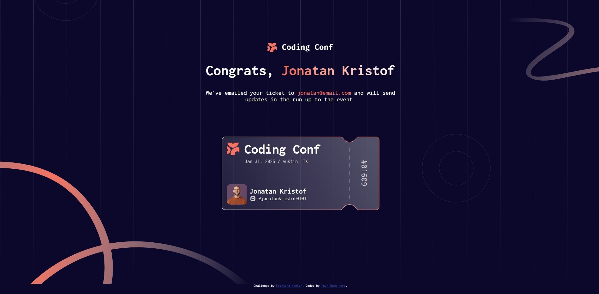
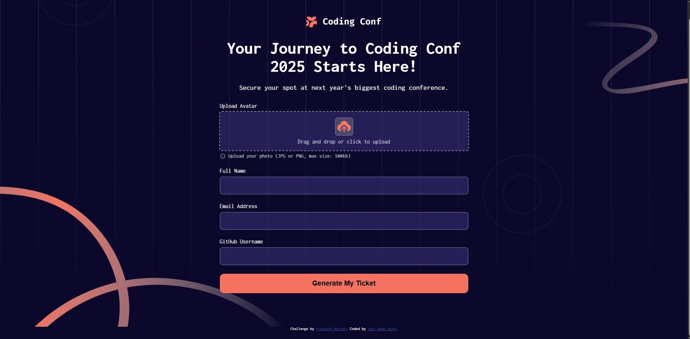

# Frontend Mentor - Conference ticket generator solution

This is a solution to the [Conference ticket generator challenge on Frontend Mentor](https://www.frontendmentor.io/challenges/conference-ticket-generator-oq5gFIU12w). Frontend Mentor challenges help you improve your coding skills by building realistic projects. 

## Table of contents

- [Overview](#overview)
  - [The challenge](#the-challenge)
  - [Screenshot](#screenshot)
  - [Links](#links)
- [My process](#my-process)
  - [Built with](#built-with)
  - [What I learned](#what-i-learned)
  - [Continued development](#continued-development)
  - [Useful resources](#useful-resources)
- [Author](#author)
- [Acknowledgments](#acknowledgments)

## Overview

### The challenge

Users should be able to:

- Complete the form with their details
- Receive form validation messages if:
  - Any field is missed
  - The email address is not formatted correctly
  - The avatar upload is too big or the wrong image format
- Complete the form only using their keyboard
- Have inputs, form field hints, and error messages announced on their screen reader
- See the generated conference ticket when they successfully submit the form
- View the optimal layout for the interface depending on their device's screen size
- See hover and focus states for all interactive elements on the page

### Screenshot




### Links

- Solution URL: [Add solution URL here](https://your-solution-url.com)
- Live Site URL: [Add live site URL here](https://your-live-site-url.com)

## My process

### Built with

- Semantic HTML5 markup
- CSS custom properties
- Flexbox
- CSS Grid
- [Styled Components](https://styled-components.com/) - For styles

### What I learned

```html
<div class="headings">
  <h1>Congrats, <span id="header-name" class="gradient-text">! Your Ticket is ready.</span></h1>
  <p>We've emailed your ticket to <span id="display-email" class="header-email"></span> and will send updates in the run up to the event.</p>
</div>
```
```css

@media (max-width: 540px) {
  .svg-image:nth-child(2) {
    top: 50px;
  }
}
```
```js
function validateTextInputs() {
  let isValid = true;
}
```

### Continued development
I would love to move to backend after mastering frontend

### Useful resources

- [Example resource 1](https://boiyee.github.io/Calculator/) - Helped while writing my javascript file.
- [Example resource 2](https://boiyee.github.io/Four-Card-Feature/) - Helped with styling

## Author

- Website - [Add your name here](https://www.github.com/Boiyee)
- Frontend Mentor - [@yourusername](https://www.frontendmentor.io/profile/Boiyee)
- Twitter - [@yourusername](https://www.twitter.com/OduwaleJubreel)

## Acknowledgments
Thanks to various youtube videos, my knowledge and patience.